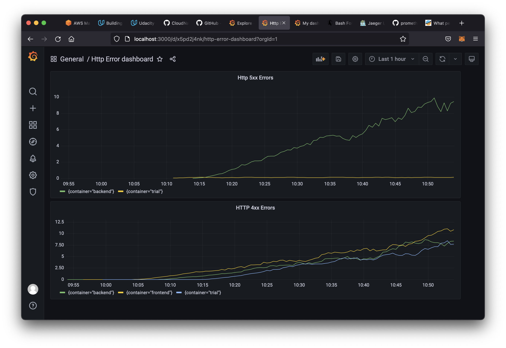
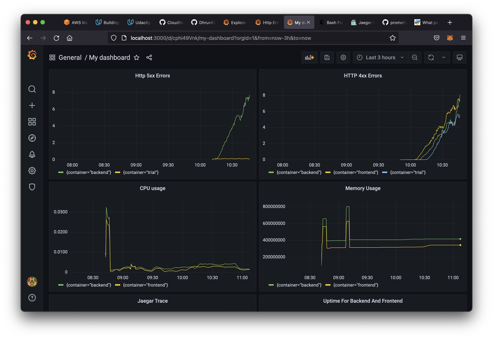
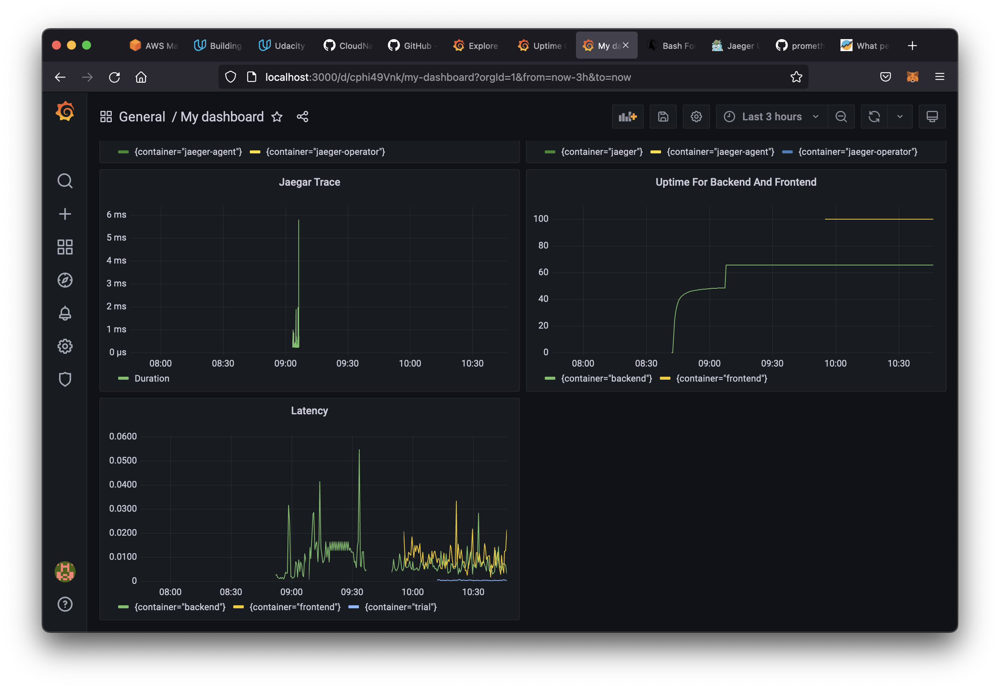

**Note:** For the screenshots, you can store all of your answer images in the `answer-img` directory.

## Verify the monitoring installation

*TODO:* run `kubectl` command to show the running pods and services for the three components. Copy and paste the output or take a screenshot of the output and include it here to verify the installation

## Setup the Jaeger and Prometheus source
*TODO:* Expose Grafana to the internet and then setup Prometheus as a data source. Provide a screenshot of the home page after logging into Grafana.

## Create a Basic Dashboard
*TODO:* Create a dashboard in Grafana that shows Prometheus as a source. Take a screenshot and include it here.

## Describe SLO/SLI
*TODO:* Describe, in your own words, what the SLIs are, based on an SLO of *monthly uptime* and *request response time*.

- SLI or Service Level Indicators are metrics that indicate whether we achieved our SLOs (Service Level Objectives).
- An SLI for the monthly uptime could be a metric that keeps track of http code status from the application. With this we can know if the application was unavailable at anytime. This will be tracked over a one month period based on the SLO requirements.
- An SLI for the request response time should be a metric that measures latency in requests.

## Creating SLI metrics.
*TODO:* It is important to know why we want to measure certain metrics for our customer. Describe in detail 5 metrics to measure these SLIs. 

- Latency, or the time taken to serve a request (usually measured in ms).
- Traffic, or the amount of stress on a system from demand (such as the number of HTTP requests/second).
- Errors, or the number of requests that are failing (such as number of HTTP 500 responses).
- Saturation, or the overall capacity of a service (such as the percentage of memory or CPU used).
- Uptime, or the percentage of time the website/webservices are available and functioning.

## Create a Dashboard to measure our SLIs
*TODO:* Create a dashboard to measure the uptime of the frontend and backend services We will also want to measure to measure 40x and 50x errors. Create a dashboard that show these values over a 24 hour period and take a screenshot.

## Tracing our Flask App
*TODO:*  We will create a Jaeger span to measure the processes on the backend. Once you fill in the span, provide a screenshot of it here.

## Jaeger in Dashboards
*TODO:* Now that the trace is running, let's add the metric to our current Grafana dashboard. Once this is completed, provide a screenshot of it here.

## Report Error
*TODO:* Using the template below, write a trouble ticket for the developers, to explain the errors that you are seeing (400, 500, latency) and to let them know the file that is causing the issue.

TROUBLE TICKET

Name: Error in adding a new star in the backend

Date: 04-09-2021

Subject: 500 error while adding a new star

Affected Area: Adding a new star in the backend

Severity: High

Description: Sending a post request to the `/star` endpoint returns a 500 status code. This should be investigated and fixed.

## Creating SLIs and SLOs
*TODO:* We want to create an SLO guaranteeing that our application has a 99.95% uptime per month. Name three SLIs that you would use to measure the success of this SLO.

- Service uptime should be greater than 99.95%
- HTTP status code should be 20X for more than 99.95% of requests
- HTTP status code should be 50X or 40x for less than 0.05% of requests

## Building KPIs for our plan
*TODO*: Now that we have our SLIs and SLOs, create KPIs to accurately measure these metrics. We will make a dashboard for this, but first write them down here.

- Service uptime all applications should be greater than 99.95%
- HTTP request average response time should be less than 100ms.
- CPU usage should be less than 70%
- Memory usage should be less than 70%.
- HTTP status code should be 50X or 40x for less than 0.05% of requests

## Final Dashboard
*TODO*: Create a Dashboard containing graphs that capture all the metrics of your KPIs and adequately representing your SLIs and SLOs. Include a screenshot of the dashboard here, and write a text description of what graphs are represented in the dashboard.  

- Http 4xx Error, Http 5xx Error, Memory Usage, CPU usage

- Jaegar Trace, Latency, uptime

